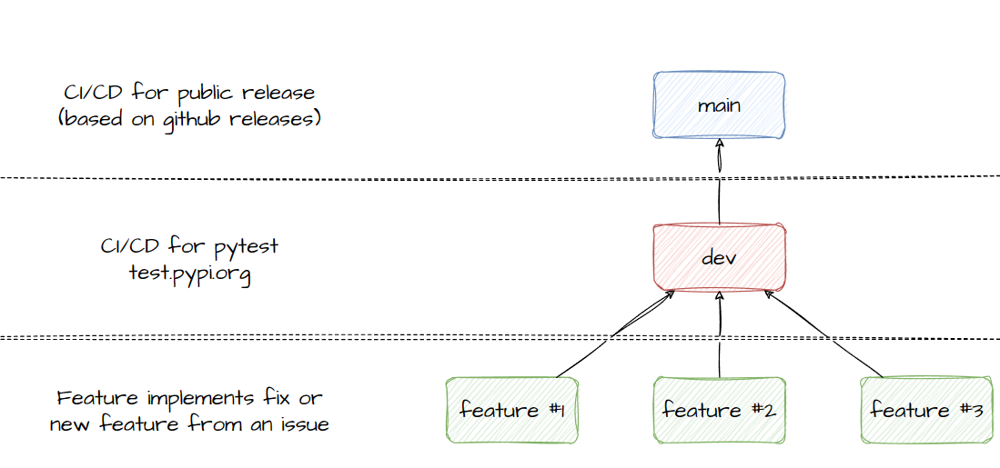

# Branch Structure

Keeping it simple, no one is allowed to push directly into the main branch unless you are an administrator and its a last resort, however its strongly advised never to push directly to main to perform a hotfix due to the workflow of creating a release from the main branch to kick off the PyPI package upload.

!!! info
    The "staging" branch is simply called `dev`. This branch should incorprate all feature branches and run CI/CD to perform all relevant tests before a merge request is created into `main`.

Typically, you should raise an issue (or create an issue from a project task) and assign a branch to the relevant issue, issues are used to track progress and then will be used to merge into the `dev` branch. Always ensure before you create a merge request into `dev`, that your feature branch is up to date with the latest dev branch to avoid merge conflicts.
