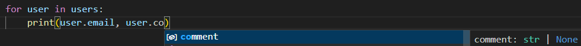
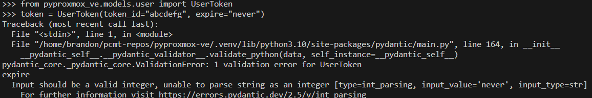

# pyproxmox-ve

This is a Python module using aiohttp to interact with Proxmox VE's HTTP API.

## How to install

With Pydantic:
```bash
pip install pyproxmox-ve[pydantic]
```

Without Pydantic:
```bash
pip install pyproxmox-ve
```

Now let me tell you why you SHOULD install with [Pydantic](https://docs.pydantic.dev/latest/).

## What is Pydantic?

Pydantic is a library which provides data validation and sanization. pyproxmox-ve has been tightly integrated with Pydantic data models to provide input validation before sending data to the API but also ensures the returned data is in-tact and formatted correctly according to Proxmox's API specification.

Pydantic has various integrations out of the box but the most common one is VSCode, because Pydantic is built ontop of standard Python type annotations, we get an improved developer experience with autocompletion (`IntelliSense`) during the development lifecycle.






## Do you provide a non-async version?

No. This module only supports aiohttp which means you must develop using asynchronous programming. If you need a non-async module, then there are a few out there which you can use with a quick google.
